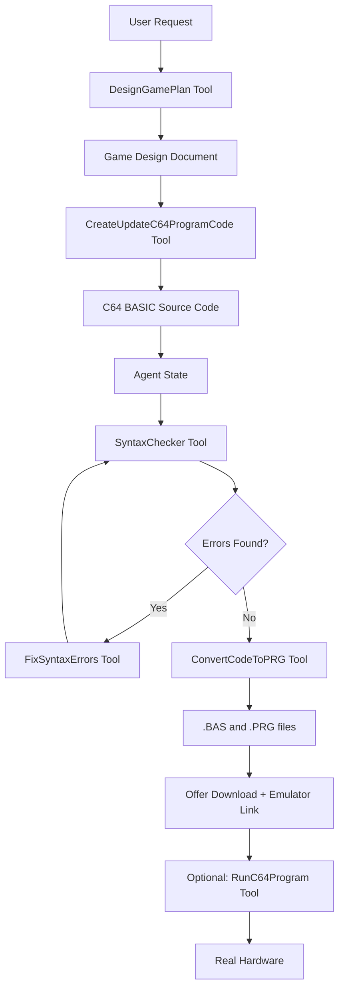

# VibeC64 - AI-Powered Commodore 64 Game Creator


VibeC64 is an AI agent specialized in creating games for the Commodore 64 computer using BASIC. It leverages modern AI models (LLMs) to design, code, test, and optionally run C64 programs on real hardware or emulators.

YouTube video:

[](https://youtu.be/om4IG5tILzg)

## ✨ Features

- **AI-Powered Game Design**: Create complete game designs based on an idea
- **Automatic Code Generation**: Generates syntactically correct C64 BASIC code
- **Syntax Checking**: Built-in LLM-based and rule-based syntax validation
- **Autonomous Gameplay / Testing**: The AI can test (play) the created game via C64 keyboard and screen capture integration (experimental)
- **Hardware Integration**: Optional support for real C64 hardware. Only available when deployed locally.
  - Experimental C64U support (using its REST APIs)
  - KungFu Flash USB device for program loading (requires modified firmware)
  - Direct C64 keyboard control via a custom built device (experimental)
  - Video capture for screen analysis
- **Dual User Interfaces**: 
  - **Web UI**: User-friendly web interface with file upload and download and emulator integration
  - **CLI**: Terminal-based interface for command-line enthusiasts
- **Multiple LLM Providers**: Support for Google AI, Anthropic, OpenAI, and OpenRouter

## 📋 Requirements 

- Python 3.12+ (when running locally)
- API key from one of the supported AI providers:
  - Google AI Studio
  - Anthropic
  - OpenAI
  - OpenRouter (provides access to multiple models with one key)

## 🔑 Getting API Keys

### OpenRouter (easiest)
1. Register at [openrouter.ai](https://openrouter.ai)
2. Add credits at [openrouter.ai/settings/credits](https://openrouter.ai/settings/credits)
3. Get API key at [openrouter.ai/settings/keys](https://openrouter.ai/settings/keys)
4. Provides access to multiple AI models with single key

### Direct Provider Keys
- **Google**: [aistudio.google.com/app/api-keys](https://aistudio.google.com/app/api-keys)
- **Anthropic**: [console.anthropic.com](https://console.anthropic.com)
- **OpenAI**: [platform.openai.com/api-keys](https://platform.openai.com/api-keys)

### Recommended Models
- **Best Price / Performance**: Google Gemini 3.0 Flash Preview (fast & cost-effective)
- **Highest Quality**: Anthropic Claude 4.5 Sonnet or Google Gemini 3.0 Pro (slower but potentially more capable)
- **Alternative**: OpenAI GPT-5.2 
- **Open Source**: no open source models have been tested yet, feel free to share your experience with them and report issues (if any)

### Optional Hardware
- KungFu Flash USB device, with modified firmware (for loading programs on real C64)
- Experimental C64U support (using its REST APIs)
- USB keyboard interface for C64 (details: [utils/c64_keyboard.md](utils/c64_keyboard.md))
- Video capture device (for screen capture analysis, optional)

## 🚀 Installation

1. Clone the repository:
```bash
git clone https://github.com/bbence84/VibeC64.git
cd VibeC64
```

2. Create a new Python virtual environment in the folder, i.e. using venv.
NOTE: Some of the dependencies of this project won't work with Python 3.14, please use 3.12 instead!

3. Install dependencies:
```bash
pip install -r requirements.txt
```

4. Configure environment variables:
```bash
cp .env_template .env
```

5. Edit `.env` and add your AI provider credentials:
```
AI_MODEL_PROVIDER=google_genai
AI_MODEL_NAME=gemini-3-flash-preview
API_KEY=your_api_key_here

# Optional: For LangSmith tracing
LANGCHAIN_TRACING_V2=false
LANGCHAIN_API_KEY=your_langsmith_key_here

# Optional: For direct HW access
# C64_KEYBOARD_DEVICE_PORT=XXX
# KUNGFU_FLASH_PORT=XXX
# C64U_API_BASE_URL="http://192.168.1.100"
# USB_CAMERA_INDEX=0

```
Possible AI providers: anthropic, openai, azure_openai, google_genai, openrouter. When using OpenRouter, specify the model name with the prefix as shown on the OpenRouter model page, i.e. google/gemini-3-flash-preview

## 🎯 Usage

### Web Interface (Recommended)

```bash
chainlit run main.py
```

The web interface will open at `http://localhost:8000`. You can:
- Set your AI model and API key in the settings panel (⚙️ icon) - if you haven't specified them in the .env file
- Chat with the agent to create C64 games
- Download generated `.bas` and `.prg` files
- Launch programs directly in an online C64 emulator

### Command Line Interface

```bash
python vibec64_cli.py
```

The CLI provides a terminal-based interface with rich formatting and markdown support.

## 📁 Folder Structure

```
VibeC64/
│
├── main.py           # Main Chainlit web interface
├── vibec64_cli.py          # Command-line interface
├── chainlit.md             # Chainlit welcome message
├── requirements.txt        # Python dependencies
├── env_template            # Environment variables template
├── README.md               # This file
│
├── .chainlit/              # Chainlit configuration
│   ├── config.toml         # Chainlit settings
│   └── translations/       # UI translations (multiple languages)
│
├── tools/                  # Agent tools and state management
│   ├── agent_state.py      # Agent state schema
│   ├── coding_tools.py     # Code generation and syntax checking tools
│   ├── game_design_tools.py    # Creates detailed design based on user request
│   ├── testing_tools.py    # Testing and validation tools
│   └── hw_access_tools.py  # Hardware interaction tools (C64, KungFu Flash)
│
├── utils/                  # Utility modules
│   ├── llm_access.py       # LLM provider abstraction
│   ├── agent_utils.py      # Agent helper functions
│   ├── chainlit_middleware.py  # Chainlit integration middleware
│   ├── c64_syntax_checker.py   # C64 BASIC syntax validation
│   ├── bas2prg.py          # BASIC to PRG converterF
│   ├── c64_hw.py           # C64 hardware interface
│   ├── c64_keymaps.py      # C64 keyboard mappings
│   ├── kungfuflash_usb.py  # KungFu Flash USB communication
│   └── formatting.py       # Output formatting utilities
│
├── resources/              # Resource files
│   └── examples_c64basic/           # Example C64 BASIC programs (for the AI agent to learn from)
│   └── examples_xcbasic3/           # Example C64 XC=BASIC programs (for the AI agent to learn from)
│
├── output/                 # Generated programs output directory
│
└── public/                 # Web interface assets
    ├── avatars/           # Chat avatars
    └── elements/          # Custom UI elements
        └── RunProgramButtons.jsx  # Run program buttons component (emulator, KungFu Flash, C64U)
```

## 🔧 How It Works

### Architecture Overview

VibeC64 is built on the **LangChain** AI agent framework for orchestration. The web interface uses **Chainlit** for a modern, interactive chat experience.

### Core Components

#### 1. Agent Tools

The agent has access to three main tool categories:

##### **Coding Tools** (`tools/coding_tools.py`)
- **CreateUpdateC64ProgramCode**: Generates or modifies C64 BASIC code based on design plans
- **SyntaxChecker**: Validates code syntax using LLM or rule-based checking
- **FixSyntaxErrors**: Automatically corrects syntax errors
- **ConvertCodeToPRG**: Converts BASIC text to C64 PRG binary format
- **StoreSourceInAgentMemory**: Stores an arbitrary BASIC code in the agents memory for processing

##### **Games Design Tools** (`game_design_tools.py`)
- **DesignGamePlan**: Creates detailed game design documents using LLM

The code generation process:
1. User provides game concept
2. Agent creates detailed design plan
3. Design plan is passed to LLM coder model
4. Generated code is stored in agent state
5. Syntax checker validates the code
6. If errors exist, FixSyntaxErrors tool corrects them
7. Cycle repeats until code is error-free

##### **Testing Tools** (`tools/testing_tools.py`)
- **CaptureC64Screen**: Captures C64 screen via video input device and compares the screen reading to an expected result
- **SendTextToC64**: Sends text or keystrokes to the connected physical machine (via a custom Arduino device)
- **AnalyzeGameMechanics**: Analyzes the source code of the game to learn how it can be played

##### **Hardware Access Tools** (`tools/hw_access_tools.py`)
- **RunC64Program**: Loads and executes programs on real C64 via KungFu Flash (using a modified firmware) or the C64U API

#### 2. Agent State Management (`tools/agent_state.py`)

The agent maintains state across interactions, storing the current C64 BASIC source code and any syntax errors detected. This allows the agent to:
- Iteratively refine code without losing context
- Track syntax errors across checking cycles
- Maintain conversation history and todo lists

#### 3. LLM Access Layer (`utils/llm_access.py`)

The `LLMAccessProvider` class provides a unified interface to multiple AI providers:

- **Model Mapping**: Translates user-friendly model names to provider-specific identifiers
- **Provider Support**: Google AI, Anthropic, OpenAI, and OpenRouter
- **Dynamic Initialization**: Allows runtime model switching without restart
- **API Key Management**: Securely handles credentials for different providers

#### 4. Web Interface Flow (`main.py`)

The web interface starts by setting up the AI connection, checking if C64 hardware is connected, and displaying a welcome message. It then creates the agent with access to code generation tools, testing tools, and file management capabilities.

When a user sends a message, the agent processes it and streams the response back for a natural chat experience. Users can change their AI model or API key at any time through the settings panel without needing to restart the application.

#### 5. Middleware Stack

The agent uses three middleware layers:

1. **TodoListMiddleware**: Tracks agent's task progress
   - Breaks down complex requests into steps
   - Shows users what the agent is working on
   - Helps ensure systematic completion

2. **FilesystemMiddleware**: Manages file operations
   - Provides filesystem tools to agent
   - Handles file reading, writing, listing

3. **ChainlitMiddlewareTracer**: Integrates with UI
   - Captures tool calls and displays them in chat
   - Formats tool outputs for user-friendly display
   - Handles file downloads and external links

#### 6. Code Generation Workflow

The complete workflow for creating a C64 game:



#### 7. Hardware Integration

When C64 hardware is available:

- **KungFu Flash**: USB device that allows loading programs directly
- **Commodore 64 Ultimate**: Experimental. Supports sending programs directly to the Commodore 64 Ultimate via its REST APIs
- **C64 Keyboard**: Experimental. Serial interface for sending keystrokes (for testing the game, details: [utils/c64_keyboard.md](utils/c64_keyboard.md)
- **Capture Device**: Video capture for screen analysis via OpenCV (for testing the game)

#### 8. Error Handling & Validation

Multi-layered validation ensures code quality:

1. **LLM-based Syntax Checking**: Uses AI to understand context and find logical errors
2. **Rule-based Checking**: `c64_syntax_checker.py` validates BASIC syntax rules
3. **Iterative Refinement**: Agent loops until code passes all checks
4. **User Feedback**: Users can report issues and agent will fix them

### Example Interaction Flow

1. User: "Create a simple snake game"
2. Agent: Uses DesignGamePlan to create detailed design
3. Agent: Uses CreateUpdateC64ProgramCode with full design plan
4. Agent: Stores code in `current_source_code` state
5. Agent: Runs SyntaxChecker to validate
6. Agent: If errors found, uses FixSyntaxErrors and rechecks
7. Agent: Converts to PRG format
8. Agent: Offers download and emulator link
9. (Optional) Agent: Loads on real C64 and captures screen

## 🎮 Example Games

The `resources/examples/` folder contains sample C64 BASIC programs:
- **adv.bas**: Text adventure game
- **gengszter.bas**: A hungarian text based adventure game
- **space_invaders.bas**: Space invaders clone
- **bowl_and_score.bas**: Bowling game with characters
- **terror_town.bas**: Text based adventure game
- **commander.bas**: War simulation

These examples are used by the LLM as few-shot examples for better syntax following and game design ideas.

## 🐛 Troubleshooting

### API Key Issues
- Ensure API key is correctly entered in settings
- Check that you have credits/quota with your provider
- Verify the model name matches your provider's offerings

### Hardware Connection Issues
- Check USB connections for KungFu Flash and capture device
- Ensure C64 is powered on and KungFu Flash is properly initialized, and the correct firmware is uploaded (details coming soon)

### Code Generation Issues
- Be specific in your game descriptions
- Provide clear requirements and constraints
- Use the fix/modify feature if initial generation needs improvement (either specify the error in text and/or upload a screenshot)

## 📝 Development Status

**Current Status**: BETA

### Completed Features
- ✅ Web and CLI interfaces
- ✅ Multiple LLM provider support
- ✅ Code generation and syntax checking
- ✅ Hardware integration
- ✅ File download and emulator links

### Planned Features
- 🔄 More BASIC V2 game examples for demonstrating more complex games
- 🔄 Sprite and graphic asset generation using generative AI
- 🔄 Sound effect and music generation tools
- 🔄 User registration and conversation persistency
- 🔄 Multi-language UI support
- 🔄 Test case generation and execution for the created game


## 🤝 Contributing

Contributions are welcome! Please feel free to submit issues or pull requests.

## 📄 License

MIT

## 🙏 Acknowledgments

- Built with [LangChain](https://langchain.com) and [LangGraph](https://langchain-ai.github.io/langgraph/)
- Web UI powered by [Chainlit](https://chainlit.io)
- Hardware integration via KungFu Flash USB device (using a modified firmware)

---

**Note**: This is a beta release. Some features may be experimental or incomplete, bugs might occur. Hardware integration requires specific USB devices and is optional for using the emulator-based features.